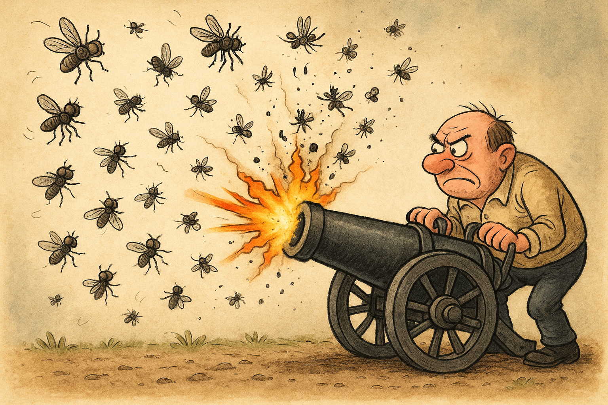

<div align="center">

# The Beach Challenge Problem

## How to build optimal LLM systems that can reason and compute 🤖

</div>

#### Table of Contents

- [What's this repo about?](#whats-this-repo-about)
- [What's the Beach Challenge Problem?](#whats-the-beach-challenge-problem)
- [Steps to build an AI system that can solve problems like this](#steps-to-build-an-ai-system-that-can-solve-problems-like-this)
  - [1. Set up the tools](#1-set-up-the-tools)
  - [2. Generate the evaluation dataset](#2-generate-the-evaluation-dataset)
  - [3. Build a strong baseline solution](#3-build-a-strong-baseline-solution)
  - [4. Evaluate the baseline solution](#4-evaluate-the-baseline-solution)
  - [5. Are we done?](#5-are-we-done)
- [Next steps](#next-steps)

## What's this repo about?

This is a step by step guide to help you build AI system that can reason and compute, for example to solve Maths problems.

In particular, we will be working with the *Beach Challenge Problem.*

## What's the Beach Challenge Problem?

It is a relatively easy Maths problem for a high-school student, that goes along these lines.
```
Kai and Sofia start at the same point on a beach.

Sofia decides to swim directly toward a buoy that's 6 km offshore at a 30° angle from the shoreline. She swims at 2 km/hour, but ocean currents push her sideways at 0.5 km/hour perpendicular to her intended direction.

Meanwhile, Kai takes his longboard and paddles along the shoreline at 4 km/hour for the first hour. After exactly 1 hour, he turns and paddles directly toward Sofia's current position at 3 km/hour (slower because he's now fighting waves).

If both continue for a total of 2.5 hours from the start, what is the distance between them at the end?
```


This is a made up problem by me, inspired by a similar (but way easier problem) I kept on asking my 4-year old son Kai during our summer holidays this year in Menorca, Spain.

I just hope this episode of his life won't end up in one of his psychoterapy sessions 40 years from now.

Solving this problem requires both reasoning and math, like:

- Use trigonometry to track Sofia's actual path (accounting for current drift)
- Calculate positions at multiple time intervals
- Determine when and where Kai changes direction
- Account for Kai's speed change
- Find Sofia's position when Kai starts heading toward her
- Calculate final positions using vector components
- Apply the distance formula to find the final separation


## Steps to build an AI system that can solve problems like this

### 1. Set up the tools

I used (you won't believe it) [`uv`](https://github.com/astral-sh/uv) to encapsulate all Python project dependencies.

To get up and running, make sure you have `uv` installed in your system

```bash
curl -LsSf https://astral.sh/uv/install.sh | sh
```

If you go to the dependencies section of the `pyproject.toml` file you will see something like this
```toml
[project.dependencies]
...
baml-py==0.202.1
opik>=1.8.17
...
```

Ok, there are probably more dependencies, but these 2 are fundamental for the project:

- [`baml-py`](https://github.com/boundaryml/baml) is a token-effective way to get structured output from your LLM, which is essential if you want to build a reliable system that calls and uses LLM output.

- [`opik`](https://github.com/comet-ml/opik) is an open-source LLM evaluation tool that makes it quite easy to manage evaluation datasets, experiments and LLM application tracing.


### 2. Generate the evaluation dataset

Before diving into a potentially never-ending rabbit hole of agent workflows and blah blah blah, you need to establish a criteria to measure how good each solution you design is.

And for that, you need to generate a dataset of problems and solutions.

In this case, the problem can be solved exactly using a simple Python function, that encapsulates the steps that map the initial problem quantities (e.g. Sofia's speed, Kai's speed, etc.) to the final solution (e.g. the distance between them).

You can find it in the [`scripts/generate_evaluation_dataset.py`](scripts/generate_evaluation_dataset.py) file.

To generate the dataset, run:

```bash
uv run python scripts/generate_evaluation_dataset.py --n_problems 10 --dataset_name beach_challenge_problem_dataset
```

This will generate a dataset of 10 problems and solutions, and push it to the Opik evaluation platform.


### 3. Build a strong baseline solution

Strong generalist models like Claude Sonnet 4, GPT-5 and others are useful to build quick baseline solutions, without you having to think too hard about the problem.

In this case, the task does not depend on external data. It is all about reasoning and doing aritmetic right.

In the `src/beach_challenge_problem/baml_src/solve_problem.baml` file you can find the BAML function that used Claude Sonnet 4 to extract a numeric answer and and the underlying reasoning the model followed.

You can find the complete agent implementation in [`src/beach_challenge_problem/agents/one_shoot_agent.py`](src/beach_challenge_problem/agents/one_shoot_agent.py).


### 4. Evaluate the baseline solution

To evaluate the model, I have added an `evaluate` method to the `GenericAgent` class, that uses the `opik` library to evaluate the model on the dataset.

I implemented two error metrics to evaluate the model:

- `RelativeErrorMetric` that measures the relative error between the model's answer and the correct answer. The higher the error, the worse the model is.

- `WithinBoundsMetric` that measures how close the model's answer is to the correct answer. The higher the score, the better the model is.

To run the evaluation I added a script that you can run either on the entire dataset

```bash
uv run python scripts/evaluate_agent.py \
    --model anthropic/claude-sonnet-4-20250514 \
    --dataset beach_challenge_problem_dataset
```

or on a specific item of the dataset.

```bash
uv run python scripts/evaluate_agent.py \
    --model anthropic/claude-sonnet-4-20250514 \
    --dataset beach_challenge_problem_dataset \
    --item_ids 01988960-c83a-75a3-b89b-6ba9a1b4fdf7
```

The evaluation results are saved as an experiment run in the Opik platform.

When I run it on my end, I get something like 90% accuracy as measured by the `WithinBoundsMetric`.

And that is not bad, but we can do better.

Especially if you (like me) care about cost-effectiveness.




### 5. Are we done?

No, we are not, unless you like to burn cash and time.
I mean, your users will not be happy with a solution that takes 10 seconds to run.
And you won't be happy burning cash to deliver that.

## Next steps
- [x] Write the problem generator script 
- [x] Create a dataset and push it to Opik
- [x] Build a strong OneShootLLM solution using Claude Sonnet 4
- [x] Evaluate it
- [ ] Swap model to DeepSeek
- [ ] Swap model to Qwen
- [ ] 2-step agent with reasoning and tool use.

## Want to learn more real world LLM engineering?

[Subscribe to Real World ML Newsletter](https://paulabartabajo.substack.com/)

I mean, it is not a newsletter, but a blog post where I share my learnings and insights about LLM engineering. And it is free, I almost forgot to say that!

[> Click here to subscribe](https://paulabartabajo.substack.com/)


